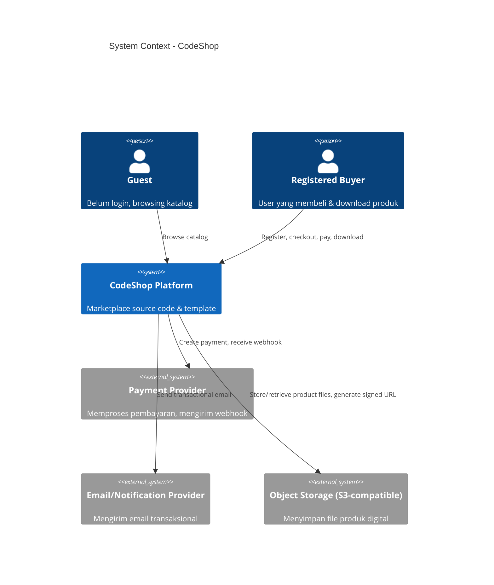
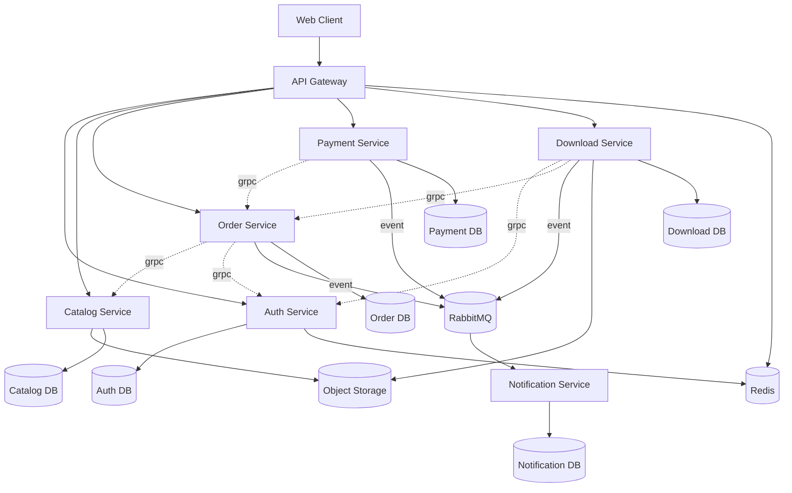
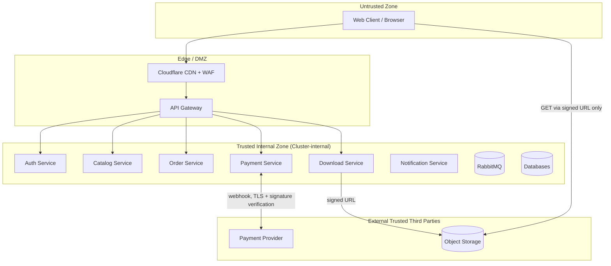
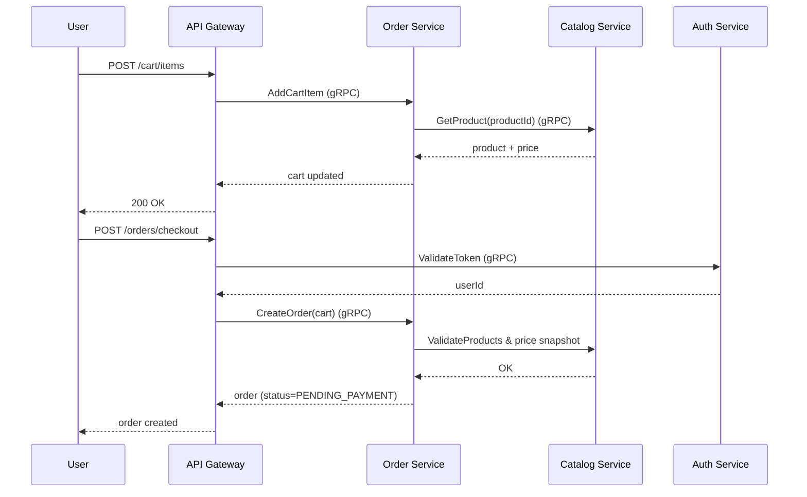
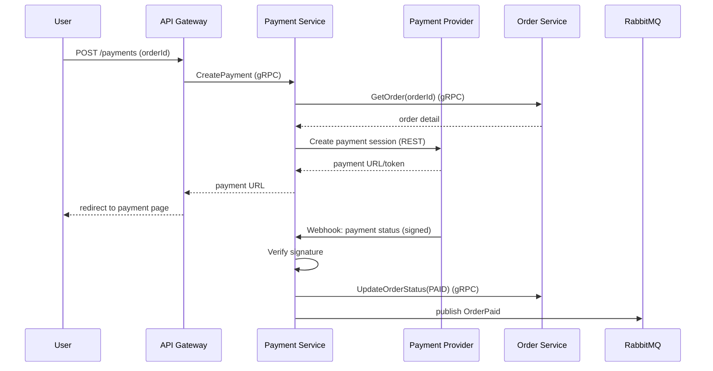
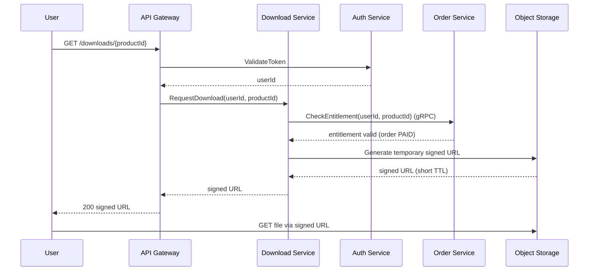
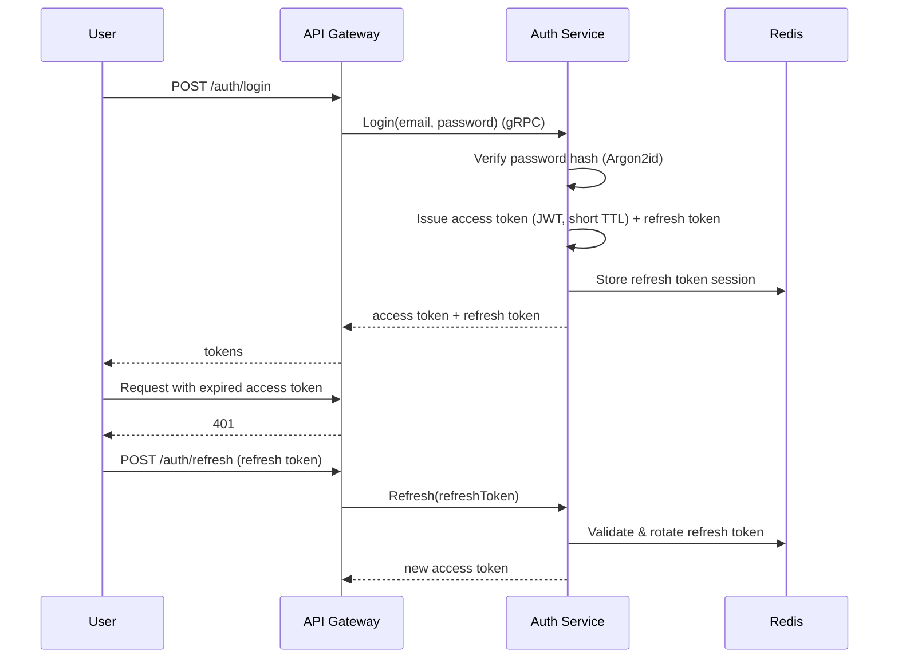
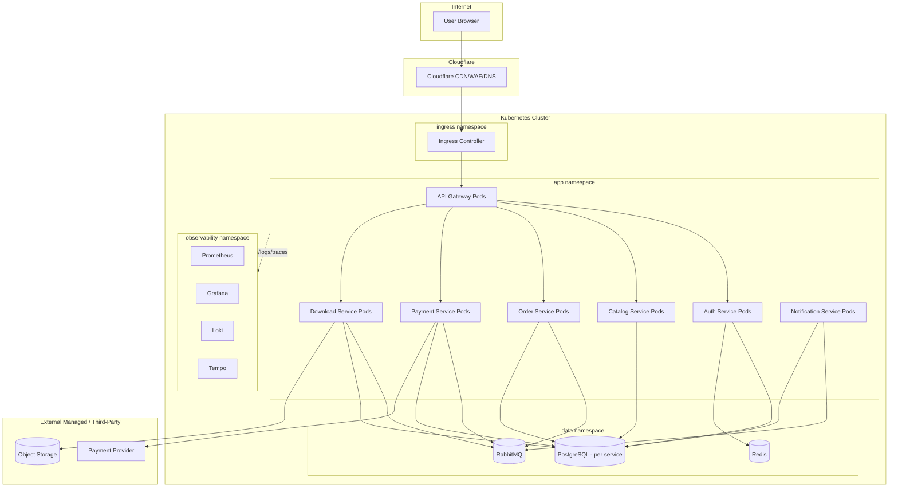

# Architecture — CodeShop

## 1. System Context

CodeShop adalah sistem marketplace digital yang berinteraksi dengan:

- **Buyer/Guest** melalui web client.
- **Payment Provider** pihak ketiga (menerima pembayaran, mengirim webhook status).
- **Email/Notification Provider** pihak ketiga (SMTP/email API) untuk mengirim notifikasi.
- **Object Storage** (MinIO/S3-compatible) sebagai tempat penyimpanan file produk digital.



## 2. High-Level Architecture

CodeShop dibangun sebagai **microservices** dengan API Gateway sebagai satu-satunya entry point publik. Setiap service memiliki database sendiri (database-per-service). Komunikasi internal menggunakan gRPC untuk synchronous call dan RabbitMQ untuk asynchronous event.



## 3. Service Architecture

Baseline service yang dievaluasi:

```text
API Gateway
Auth Service
Catalog Service
Order Service
Payment Service
Download Service
Notification Service
```

**Evaluasi**: baseline ini dipertahankan untuk MVP. Pertimbangan yang dievaluasi dan ditolak:

- **Cart sebagai service terpisah** — ditolak. Cart bersifat state sederhana dan berumur pendek (ephemeral), lebih tepat disimpan sebagai bagian dari Order Service (status `DRAFT`) atau di client-side/Redis, bukan service gRPC/database tersendiri. Membuat Cart Service terpisah menambah satu network hop dan satu database tanpa manfaat isolasi domain yang signifikan pada skala MVP. Cart didokumentasikan sebagai **sub-domain di dalam Order Service** (lihat `SERVICE_CATALOG.md`).
- **Product Version sebagai service terpisah** — ditolak, tetap menjadi bagian dari Catalog Service karena siklus hidup dan ownership data-nya melekat pada produk.
- **Search Service terpisah (mis. Elasticsearch-backed)** — ditolak untuk MVP, akan dipertimbangkan di Phase 2 jika volume katalog besar. Untuk MVP, pencarian dilakukan melalui query PostgreSQL di Catalog Service.

Detail tiap service ada di `SERVICE_CATALOG.md`.

## 4. Trust Boundaries



Prinsip: hanya API Gateway yang dapat diakses dari luar cluster. Seluruh service internal tidak memiliki exposure publik. Object storage tidak pernah diakses langsung menggunakan credential permanen oleh client — hanya melalui signed URL berumur pendek.

## 5. Security Boundaries

- **Public boundary**: Client ↔ API Gateway (TLS, rate limiting, WAF via Cloudflare).
- **Service boundary**: antar service internal menggunakan mTLS/NetworkPolicy dalam cluster (konsep, detail implementasi di Phase 2/3).
- **Data boundary**: setiap service hanya boleh mengakses database miliknya sendiri; tidak ada shared database.
- **Storage boundary**: object storage private, hanya dapat diakses via signed URL yang diterbitkan Download Service.

## 6. Network Boundaries

- Public-facing: API Gateway (di belakang Cloudflare).
- Cluster-internal only: seluruh backend service, database, Redis, RabbitMQ.
- Object storage: private bucket, network policy membatasi akses hanya dari Download/Catalog Service untuk operasi manajemen; akses publik hanya melalui signed URL.

## 7. Communication Patterns

### Synchronous (gRPC / REST)

Digunakan ketika caller membutuhkan response langsung untuk melanjutkan alur (mis. validasi ownership sebelum generate signed URL).

| Caller | Callee | Protokol | Alasan |
|---|---|---|---|
| API Gateway | Semua service | REST (public) → gRPC (internal) | Entry point publik |
| Order Service | Catalog Service | gRPC | Validasi produk & harga saat checkout |
| Order Service | Auth Service | gRPC | Validasi identitas user |
| Payment Service | Order Service | gRPC | Update status order setelah verifikasi |
| Download Service | Auth Service | gRPC | Validasi token/identitas |
| Download Service | Order Service | gRPC | Cek kepemilikan order/entitlement |

### Asynchronous (RabbitMQ Event)

Digunakan untuk efek samping yang tidak perlu diketahui hasilnya secara langsung oleh pengirim (fire-and-forget dengan guarantee delivery), dan untuk decoupling antar domain.

| Event Producer | Event | Consumer |
|---|---|---|
| Order Service | `OrderCreated` | Notification Service |
| Payment Service | `OrderPaid` | Download Service, Notification Service |
| Payment Service | `PaymentFailed` | Notification Service |
| Download Service | `DownloadGranted` | Notification Service |

Detail lengkap di `EVENT_DESIGN.md`.

## 8. Checkout Flow



## 9. Payment Flow



## 10. Download Flow



## 11. Authentication Flow



## 12. Failure Scenarios

| Skenario | Dampak | Mitigasi |
|---|---|---|
| Payment webhook gagal diterima | Order tetap `PENDING_PAYMENT` walau user sudah bayar | Payment provider melakukan retry webhook; Payment Service juga menyediakan reconciliation job (polling status ke provider) sebagai fallback — didokumentasikan sebagai kebutuhan, bukan implementasi. |
| RabbitMQ down saat `OrderPaid` dipublish | Download entitlement tertunda | Payment Service tetap mengubah status order (source of truth di DB), event dipublish ulang dengan retry/outbox pattern. |
| Object Storage tidak dapat diakses | Signed URL gagal dibuat/gagal diakses | Download Service mengembalikan error jelas; retry di sisi client; observability alert. |
| Notification Service down | Email tidak terkirim | Tidak menggagalkan alur utama (checkout/payment/download tetap berjalan); event tetap di queue untuk diproses saat service pulih. |
| Auth Service down | Seluruh service yang butuh validasi token terganggu | Auth adalah dependency kritikal; didesain untuk high availability (multiple replica) dan token JWT tetap dapat divalidasi secara stateless (signature) tanpa selalu memanggil Auth Service — lihat `API_DESIGN.md`. |

## 13. Storage Architecture

- **Relational data**: PostgreSQL, satu instance/skema logis per service (database-per-service).
- **Cache/session**: Redis — digunakan untuk cache katalog (read-heavy), session/refresh token, dan rate limiting counter.
- **Message broker**: RabbitMQ — untuk event asynchronous antar service.
- **Object storage**: MinIO/S3-compatible — menyimpan file produk digital di private bucket, tidak pernah diakses langsung oleh client kecuali melalui signed URL.

## 14. Scalability

- API Gateway dan Catalog Service (read-heavy) di-scale horizontal terlebih dahulu.
- Download Service di-scale berdasarkan concurrency permintaan signed URL, bukan berdasarkan bandwidth file (karena transfer file terjadi langsung antara client dan object storage, bukan melalui service).
- Database per service memungkinkan scaling storage/index secara independen sesuai beban masing-masing domain.

## 15. Reliability

Lihat detail di `RELIABILITY` section pada dokumen ini level project — didokumentasikan lebih lanjut sebagai bagian dari operational readiness, mencakup retry, timeout, circuit breaker, dan idempotency di level design (bukan kode).

## 16. Observability

Setiap service didesain untuk mengekspos metrics, logs terstruktur, dan traces yang dapat dikorelasikan menggunakan correlation ID/trace ID lintas service — lihat kebutuhan detail per service di `SERVICE_CATALOG.md`.

## 17. Disaster Recovery Concept

Lihat pembahasan konsep RPO/RTO dan strategi backup di bagian akhir dokumen ini (ringkasan) — detail penuh sengaja tidak diberikan sebagai file terpisah pada Phase 1 karena termasuk dalam scope `ARCHITECTURE.md` sebagai bagian dari reliability design, mencakup: backup database terjadwal, backup/versioning object storage, dan prosedur restore konseptual untuk kegagalan node Kubernetes, database, object storage, dan RabbitMQ.

## 18. Target Kubernetes Architecture



Argo CD (GitOps) mengelola deployment ke cluster ini pada Phase implementasi; Helm chart per service. Detail implementasi tidak dibahas pada Phase 1.
