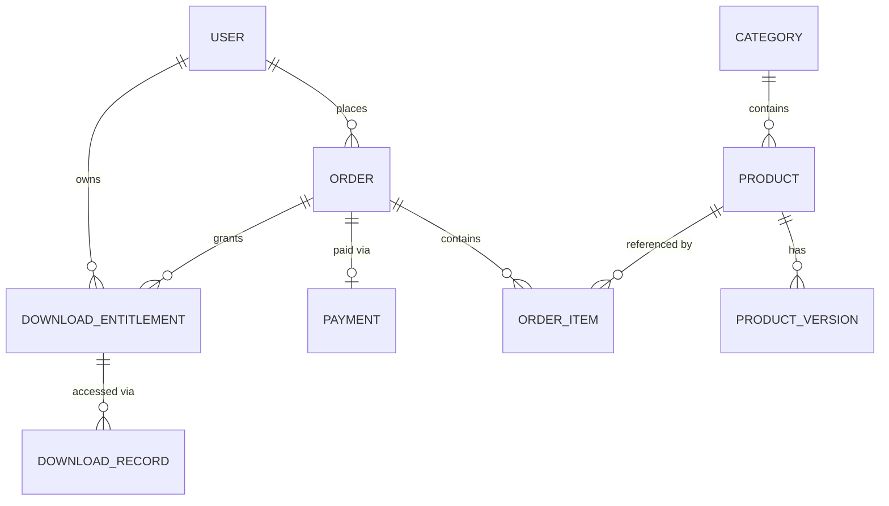

# Database Design — CodeShop

Prinsip utama: **Database per Service**. Tidak ada service yang mengakses database milik service lain secara langsung; komunikasi data lintas service hanya melalui gRPC API atau event.

## 1. Entity Ownership Table

| Entity | Service Owner |
|---|---|
| User | Auth Service |
| Role | Auth Service |
| Product | Catalog Service |
| Category | Catalog Service |
| ProductVersion | Catalog Service |
| Cart | Order Service |
| CartItem | Order Service |
| Order | Order Service |
| OrderItem | Order Service |
| Payment | Payment Service |
| DownloadEntitlement | Download Service |
| DownloadRecord | Download Service |
| Notification | Notification Service |
| AuditLog | Terdistribusi — setiap service mencatat audit log miliknya sendiri (lihat catatan §7) |

> Tidak ada SQL/DDL pada dokumen ini sesuai batasan Phase 1. Struktur di bawah bersifat konseptual.

## 2. Auth DB (Auth Service)

### Entities

- **User**: id, email (unique), password_hash, full_name, status (active/suspended), created_at, updated_at.
- **Role**: id, name (`buyer`, `admin`), assigned to User (many-to-many atau simple enum field pada MVP karena hanya 2 role).

### Relationship
`User` 1—N `Role` assignment (atau simplifikasi: field `role` langsung di `User` untuk MVP, karena kompleksitas RBAC penuh belum diperlukan).

### Important Fields
- `email` — unique, digunakan untuk login.
- `password_hash` — hasil Argon2id, tidak pernah di-expose.
- `status` — untuk mendukung suspend user tanpa hapus data.

### Indexes
- Unique index pada `email`.
- Index pada `status` untuk query admin.

### Constraints
- `email` unique dan not null.
- `password_hash` not null.

### Consistency
Strong consistency (single database, transactional).

### Retention
Data user dipertahankan selama akun aktif; kebijakan penghapusan (right to be forgotten) menjadi topik Phase 2 (perlu koordinasi dengan Order/Download untuk data historis).

### Sensitive Data
`email`, `password_hash`, `full_name` — PII, wajib dienkripsi saat transit (TLS) dan dibatasi akses melalui service boundary (tidak ada akses langsung dari service lain).

### Audit Requirements
Login attempt (berhasil/gagal), perubahan password, perubahan role dicatat sebagai audit log di Auth Service.

## 3. Catalog DB (Catalog Service)

### Entities
- **Product**: id, name, slug, description, category_id, base_price, currency, status (draft/published/deactivated), storage_object_key (referensi ke file di object storage), created_at, updated_at.
- **Category**: id, name, slug.
- **ProductVersion**: id, product_id, version_label, changelog, storage_object_key, released_at.

### Relationship
`Category` 1—N `Product`; `Product` 1—N `ProductVersion`.

### Important Fields
- `storage_object_key` pada `Product`/`ProductVersion` — referensi ke lokasi file di private bucket, **tidak pernah** berupa URL publik langsung.
- `status` — mengontrol visibilitas di katalog publik.

### Indexes
- Index pada `slug` (unique per entity untuk keperluan URL).
- Index pada `category_id`, `status` untuk listing/filtering.

### Constraints
- `slug` unique.
- `base_price` >= 0.

### Consistency
Strong consistency dalam Catalog DB. Harga yang digunakan saat checkout adalah **snapshot** yang disalin ke `OrderItem` di Order DB (bukan referensi live), sehingga perubahan harga di Catalog tidak memengaruhi order yang sudah dibuat — ini adalah keputusan eventual-consistency-safe by design.

### Retention
Produk yang deactivated tidak dihapus (soft delete) agar riwayat order/entitlement tetap valid secara referensial (by ID, bukan foreign key lintas database).

### Sensitive Data
Tidak ada data sensitif tingkat tinggi; `storage_object_key` dianggap semi-sensitif karena dapat memberi petunjuk struktur storage internal — akses dibatasi hanya untuk Catalog & Download Service.

### Audit Requirements
Perubahan produk oleh admin (create/update/deactivate) dicatat sebagai audit log.

## 4. Order DB (Order Service)

### Entities
- **Cart**: id, user_id, status (`DRAFT`), created_at, updated_at. *(Cart dimodelkan sebagai Order berstatus DRAFT untuk menghindari duplikasi model — lihat catatan di `ARCHITECTURE.md` §3.)*
- **CartItem**: id, cart_id (order_id), product_id (referensi by ID ke Catalog), product_name_snapshot, price_snapshot, quantity.
- **Order**: id, user_id, status (`DRAFT`/`PENDING_PAYMENT`/`PAID`/`CANCELLED`/`EXPIRED`), total_amount, currency, created_at, updated_at.
- **OrderItem**: id, order_id, product_id, product_name_snapshot, price_snapshot, quantity.

### Relationship
`Order` 1—N `OrderItem`. `CartItem`/`OrderItem` mereferensikan `Product` **by ID saja** (tidak ada foreign key lintas database — cross-service reference by ID adalah pola standar di seluruh sistem ini).

### Important Fields
- `status` — state machine order (lihat alur di `ARCHITECTURE.md`).
- `price_snapshot` — mencegah manipulasi/perubahan harga setelah checkout.

### Indexes
- Index pada `user_id` (untuk listing order milik user).
- Index pada `status` (untuk query operasional/reconciliation).

### Constraints
- `status` hanya dapat bertransisi sesuai state machine yang valid (mis. tidak dapat langsung dari `DRAFT` ke `PAID`).
- `total_amount` = jumlah dari `price_snapshot * quantity` seluruh `OrderItem`.

### Consistency
Strong consistency dalam Order DB untuk transisi status order (transactional). Update status dari `PENDING_PAYMENT` → `PAID` dipicu oleh Payment Service melalui gRPC synchronous call (bukan hanya event), agar status order langsung konsisten begitu payment terverifikasi.

### Retention
Order disimpan permanen sebagai riwayat transaksi (kebutuhan bisnis & kemungkinan kebutuhan pajak/audit).

### Sensitive Data
Tidak menyimpan data pembayaran; hanya referensi transaksi (jika diperlukan, `payment_reference_id`).

### Audit Requirements
Setiap perubahan status order dicatat (audit trail status transition) untuk keperluan dispute/refund.

## 5. Payment DB (Payment Service)

### Entities
- **Payment**: id, order_id, user_id, provider, provider_reference_id, amount, currency, status (`PENDING`/`SUCCESS`/`FAILED`/`EXPIRED`), webhook_received_at, created_at, updated_at.

### Relationship
`Payment` N—1 `Order` (by ID reference, lintas service).

### Important Fields
- `provider_reference_id` — untuk idempotency & rekonsiliasi dengan payment provider.
- `status` — hasil verifikasi webhook.

### Indexes
- Unique index pada `provider_reference_id` (mencegah duplikasi pemrosesan webhook).
- Index pada `order_id`.

### Constraints
- `provider_reference_id` unique — dasar mekanisme idempotency webhook.

### Consistency
Strong consistency di Payment DB. Payment adalah **source of truth** untuk status transaksi finansial; Order Service menyimpan status order sebagai hasil turunan yang diupdate secara synchronous saat verifikasi berhasil.

### Retention
Disimpan permanen untuk kebutuhan audit finansial dan potensi refund/dispute.

### Sensitive Data
**Tidak menyimpan data kartu/instrumen pembayaran mentah.** Hanya referensi/token dari payment provider. Ini adalah keputusan desain wajib untuk mengurangi scope kepatuhan (mis. PCI-DSS).

### Audit Requirements
Seluruh perubahan status payment dan setiap webhook yang diterima (termasuk yang ditolak karena signature invalid) dicatat.

## 6. Download DB (Download Service)

### Entities
- **DownloadEntitlement**: id, user_id, product_id, order_id (referensi), granted_at, status (`ACTIVE`/`REVOKED`).
- **DownloadRecord**: id, entitlement_id, user_id, product_id, ip_address, requested_at, signed_url_expires_at.

### Relationship
`DownloadEntitlement` 1—N `DownloadRecord`.

### Important Fields
- `status` pada `DownloadEntitlement` — memungkinkan revoke akses (mis. jika terjadi refund/chargeback) tanpa menghapus data historis.
- `signed_url_expires_at` — untuk audit & investigasi abuse.

### Indexes
- Index pada `(user_id, product_id)` — pengecekan entitlement cepat.
- Index pada `entitlement_id` di `DownloadRecord`.

### Constraints
- Kombinasi `(user_id, product_id, order_id)` unique per entitlement untuk mencegah duplikasi.

### Consistency
Strong consistency dalam Download DB. Entitlement dibuat berdasarkan konfirmasi dari Order Service (order status `PAID`), baik secara synchronous (MVP) maupun melalui event `OrderPaid` (opsional optimasi).

### Retention
`DownloadRecord` disimpan untuk keperluan audit abuse; kebijakan retensi jangka panjang (mis. anonymize setelah N bulan) dapat menjadi topik Phase 2.

### Sensitive Data
`ip_address` bersifat semi-sensitif (PII) — retensi dan akses dibatasi.

### Audit Requirements
Setiap penerbitan signed URL dan setiap perubahan status entitlement (grant/revoke) dicatat sebagai audit trail wajib (bagian dari Download Security).

## 7. Notification DB (Notification Service)

### Entities
- **Notification**: id, user_id, type (`EMAIL`), event_source (`UserRegistered`, dll.), recipient, status (`SENT`/`FAILED`/`RETRYING`), sent_at, created_at.

### Important Fields
- `event_source` — untuk traceability terhadap event pemicu.
- `status` — untuk retry logic dan monitoring.

### Indexes
- Index pada `user_id`, `status`.

### Constraints
- Tidak ada constraint lintas service (murni log pengiriman).

### Consistency
Eventual consistency terhadap event sumber (Notification Service adalah consumer asynchronous).

### Retention
Log notifikasi disimpan untuk troubleshooting; dapat di-archive setelah periode tertentu (Phase 2).

### Sensitive Data
`recipient` (email) — PII, retensi dibatasi sesuai kebijakan privasi.

### Audit Requirements
Kegagalan pengiriman berulang (masuk dead-letter) dicatat untuk investigasi operasional.

---

## 8. Cross-Service Reference Pattern

Karena tidak ada foreign key lintas database, seluruh referensi antar service (mis. `Order.user_id` merujuk `User` di Auth DB) menggunakan **reference by ID** yang divalidasi pada saat penulisan data (melalui gRPC call), bukan dijamin oleh database constraint. Ini adalah trade-off standar pada arsitektur database-per-service, didokumentasikan sebagai keputusan sadar, bukan kelalaian desain.

## 9. Entity Relationship Overview (Cross-Service)

> Diagram di atas menggambarkan relasi **logis lintas service** (bukan foreign key fisik). Garis penghubung merepresentasikan reference by ID yang divalidasi via API, bukan constraint database.
