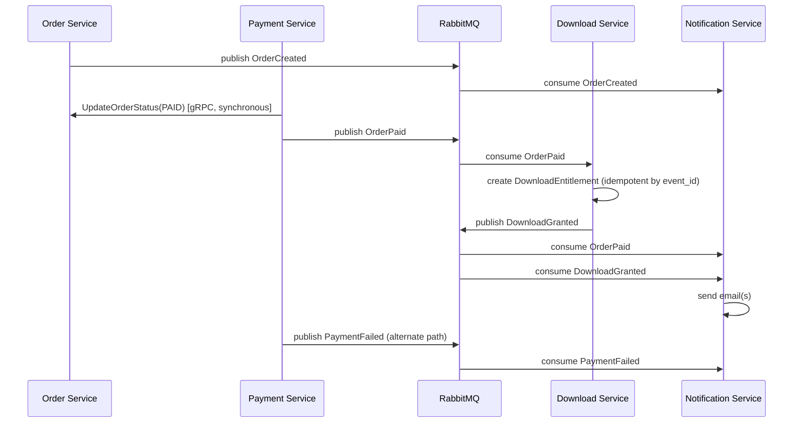

# Event Design — CodeShop

## 1. Evaluasi Kebutuhan Event

Daftar kandidat event dari brief awal dievaluasi sebagai berikut:

| Event Kandidat | Keputusan | Alasan |
|---|---|---|
| `UserRegistered` | **Dipakai** | Memicu email welcome via Notification Service. |
| `OrderCreated` | **Dipakai** | Memicu notifikasi "order dibuat, menunggu pembayaran". |
| `PaymentPending` | **Dipakai (opsional trigger notifikasi)** | Berguna untuk observability/analytics, notifikasi ke user bersifat opsional (tidak wajib email). |
| `PaymentSuccess` | **Digabung menjadi `OrderPaid`** | `PaymentSuccess` dan `OrderPaid` pada dasarnya merepresentasikan momen yang sama dari perspektif bisnis (pembayaran berhasil = order menjadi PAID). Memisahkan keduanya sebagai dua event terpisah berisiko duplikasi consumer logic dan ambiguitas "mana yang jadi trigger utama". Diputuskan: **`OrderPaid` adalah event tunggal** yang dipublish oleh Payment Service setelah update status order berhasil. |
| `PaymentFailed` | **Dipakai** | Memicu notifikasi kegagalan ke user. |
| `OrderPaid` | **Dipakai** (lihat catatan di atas) | Trigger utama untuk Download Service (buat entitlement) dan Notification Service. |
| `DownloadRequested` | **Tidak dipakai sebagai event** | Bersifat synchronous request-response (user menunggu signed URL langsung), tidak ada consumer asynchronous yang membutuhkan notifikasi "permintaan download dibuat" — akan menjadi over-engineering. |
| `DownloadGranted` | **Dipakai** | Untuk audit trail dan opsional notifikasi "produk Anda siap diunduh". |
| `DownloadCompleted` | **Tidak dipakai pada MVP** | Memerlukan callback dari object storage yang menambah kompleksitas signifikan (event dari S3-compatible storage) tanpa kebutuhan bisnis mendesak di MVP. Dicatat sebagai kandidat Phase 2 jika dibutuhkan analytics penyelesaian download. |
| `RefundRequested` | **Tidak dipakai pada MVP** | Fitur refund adalah Phase 2 (lihat `REQUIREMENTS.md`); event ini didesain saat fitur refund direalisasikan. |
| `RefundCompleted` | **Tidak dipakai pada MVP** | Sama seperti di atas. |

### Event Final MVP

```text
UserRegistered
OrderCreated
PaymentPending   (opsional/analytics)
PaymentFailed
OrderPaid
DownloadGranted
```

## 2. Event Naming

- Format: `PascalCase`, past-tense (menyatakan fakta yang sudah terjadi), tanpa versi di nama event — versi ada di envelope (`event_version`).
- Contoh: `OrderCreated`, `OrderPaid`, `PaymentFailed`.

## 3. Event Envelope

Struktur konseptual (bukan skema final/kode):

```text
{
  event_id: string (UUID),
  event_name: string,          // "OrderPaid"
  event_version: int,          // 1
  occurred_at: timestamp,
  correlation_id: string,      // konsisten sepanjang alur bisnis terkait
  producer: string,            // "payment-service"
  payload: { ... }             // data spesifik event
}
```

## 4. Producer & Consumer

| Event | Producer | Consumer |
|---|---|---|
| `UserRegistered` | Auth Service | Notification Service |
| `OrderCreated` | Order Service | Notification Service |
| `PaymentPending` | Payment Service | (analytics/observability, tanpa consumer bisnis wajib di MVP) |
| `PaymentFailed` | Payment Service | Notification Service |
| `OrderPaid` | Payment Service | Download Service, Notification Service |
| `DownloadGranted` | Download Service | Notification Service |

## 5. Event Version

- Setiap event memiliki `event_version` (integer, dimulai dari 1).
- Perubahan payload yang breaking (menghapus/mengubah tipe field) memerlukan increment versi dan consumer harus mendukung kedua versi selama masa transisi.

## 6. Correlation ID

- `correlation_id` dibuat di titik awal alur bisnis (mis. saat `OrderCreated`) dan diteruskan ke seluruh event turunan (`OrderPaid`, `DownloadGranted`) agar seluruh rangkaian dapat ditelusuri sebagai satu alur end-to-end, konsisten dengan `X-Correlation-ID` di REST/gRPC (lihat `API_DESIGN.md`).

## 7. Delivery Semantics

- RabbitMQ dikonfigurasi untuk **at-least-once delivery**.
- Konsekuensi: consumer **wajib idempotent** (lihat §9) karena pesan yang sama berpotensi diterima lebih dari sekali.

## 8. Idempotency

- Setiap consumer menyimpan/mengecek `event_id` yang sudah diproses (dedup table atau mekanisme setara) sebelum menjalankan efek samping, khususnya untuk `OrderPaid` (pembuatan entitlement tidak boleh duplikat) dan Notification Service (email tidak boleh terkirim dobel).

## 9. Retry

- Consumer yang gagal memproses pesan melakukan retry dengan **exponential backoff** (mis. 1s, 2s, 4s, ... hingga batas maksimum percobaan).
- Setelah batas maksimum tercapai, pesan dipindahkan ke Dead-Letter Queue (lihat §10), bukan di-drop begitu saja.

## 10. Dead-Letter Queue (DLQ)

- Setiap queue utama memiliki DLQ pasangan.
- Pesan di DLQ dipertahankan untuk investigasi manual/replay, disertai metrics `dlq_size` yang dipantau (lihat `ARCHITECTURE.md` §16 Observability).

## 11. Ordering

- Ordering **tidak dijamin secara global** antar event berbeda jenis.
- Untuk event dalam satu alur order yang sama (mis. `OrderCreated` → `OrderPaid`), ordering secara alami terjaga karena keduanya dipicu oleh state transition sekuensial dan konsumen (Notification Service) tidak bergantung pada urutan strict antar event berbeda entity — masing-masing notifikasi independen secara konten.
- Jika di masa depan dibutuhkan strict ordering per entity (mis. menggunakan RabbitMQ dengan single active consumer per queue atau partition key = `order_id`), ini didokumentasikan sebagai pertimbangan Phase 2, bukan kebutuhan MVP.

## 12. Eventual Consistency

- Status order (source of truth di Order DB) diupdate **synchronous** oleh Payment Service melalui gRPC sebelum event `OrderPaid` dipublish — ini mengurangi window eventual consistency untuk data kritikal (status order).
- Efek turunan seperti pembuatan `DownloadEntitlement` (jika menggunakan event, opsi optimasi) dan pengiriman notifikasi bersifat **eventually consistent** — ada jeda singkat yang dapat diterima secara bisnis (user melihat "processing" sesaat sebelum entitlement aktif).

## 13. Event Flow Diagram


